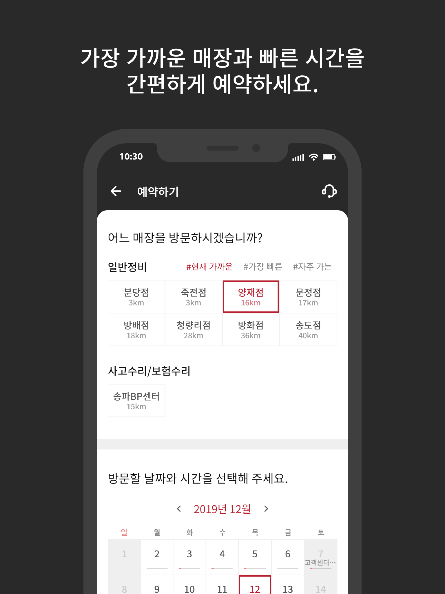
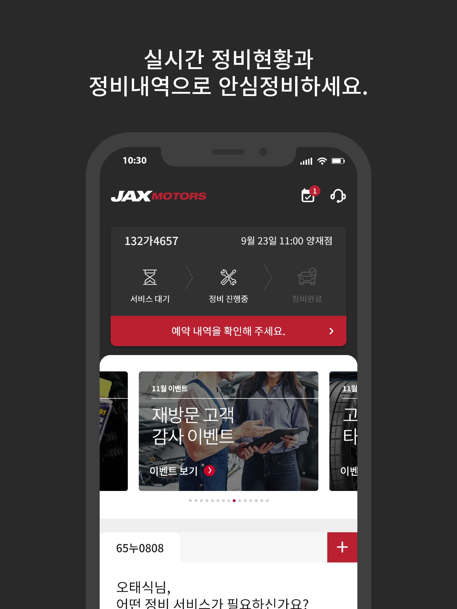
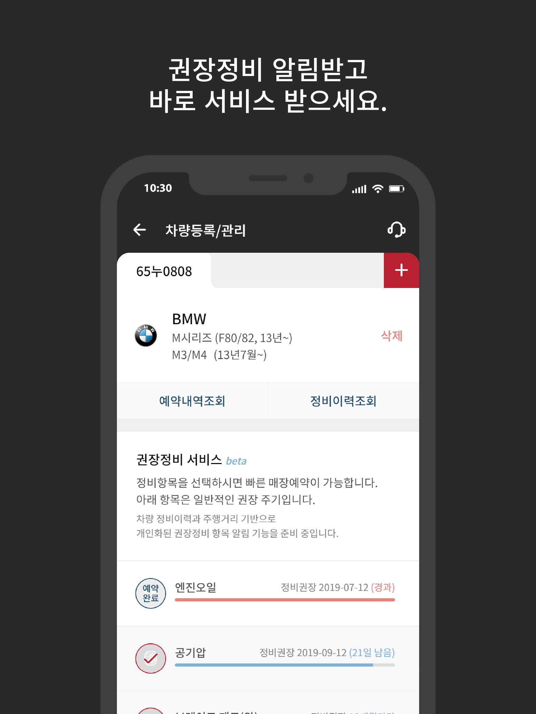
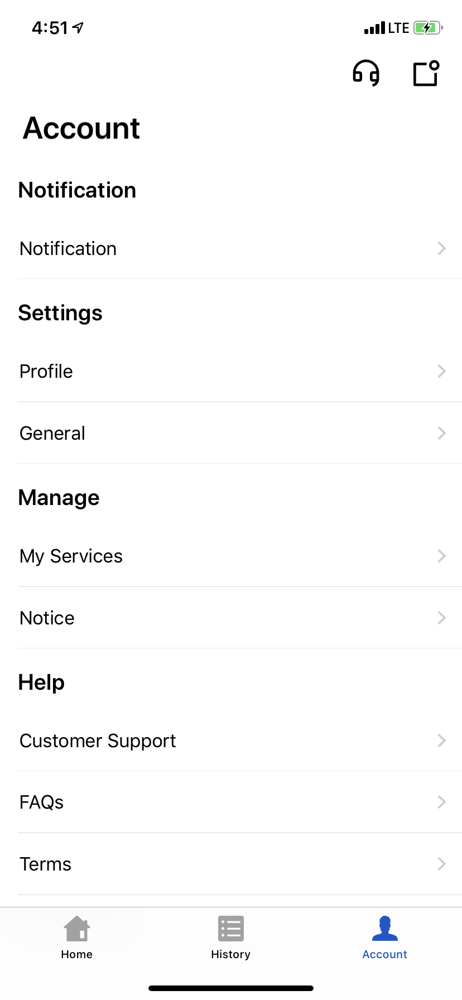
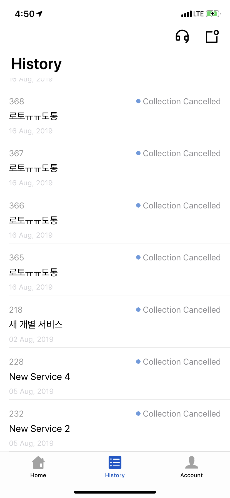

엄기철 Eom Kicheol

- iOS Developer
- Mail : <eom-kicheol@naver.com>  
- github : https://github.com/EomKicheol
    
 
경력
-
### Wavers ###
* 2019.09 ~ 

### Ecube Labs
* 2019.06 ~ 2019.09

###  딜리버리 히어로 코리아
* 2018.09 ~ 2019.03

### AppTube
* 2017.07 ~ 2018.08

### NPD 마당
* 2017.03 ~ 2017.06

    
 
### 회사 프로젝트
### iOS

### JAXMotors
- 회사 : Wavers
- 앱소개 : 앱에서 내 차 정비 이력을 앱에서 한 눈에 조회, 간편한 예약, 내 차를 위한 맞춤형 케어
- 개발 기술 : Swift, Mvvm, RxSwift,Code Base Auto Layout(Snapkit), Wkweb, AppleLogin
- 담당 업무 : 설계, 개발
- 앱스토어 : 스토어 등록 대기중

      

### HAULLA
- 회사 : Ecube Labs
- 앱소개 : generator와 hauler를 실시간 bidding & matching
- 개발 기술 : Swift, Mvvm, RxSwift,Code Base Auto Layout(Snapkit)
- 담당 업무 : 설계, 개발
- 앱스토어 : 스토어 등록 대기중

          

### 푸드플라이 라이더앱
- 회사 : 딜리버리히어로 코리아
- 앱소개 : 푸드플라이 라이더 앱
- 개발 기술 : Swift, Mvvm, RxSwift
- 담당 업무 : 개발 유지/보수 작업
- 앱스토어 : 사내 배포용

### 하이타이
- 회사 : AppTube
- 앱소개 : 위치 기반의 태국 마사지샵 검색 서비스
- 개발 기술 : Swift, Mvvm, RxSwift, Code Base Auto Layout(Snapkit)
- 담당 업무 : 설계 및 개발 유지/보수 작업
- 앱스토어  : https://itunes.apple.com/kr/app/id947725771

    

### 모시러 드라이버
- 회사 : AppTube
- 앱소개 :  위치 기반의 시간제 차량 수행 기사 서비스
- 개발 기술 : Swift, Mvvm, RxSwift, Code Base Auto Layout(Snapkit)
- 담당 업무 : 설계 및 개발 유지/보수 작업
- 앱스토어 : https://itunes.apple.com/app/apple-store/id1262965984

   

### 동화면세점 국문, 중문
- 회사 : AppTube
- 앱소개 : 동화면세점 제품 구매를 위해 제작된 앱
- 개발 기술 : Swift, WebKit
- 담당 업무 : 설계 및 개발 유지/보수 작업
- 앱스토어 : https://itunes.apple.com/kr/app/%EB%8F%99%ED%99%94%EB%A9%B4%EC%84%B8%EC%A0%90/id695404582?mt=8

    

### 골목대장 통 유저, 상점용
- 회사 : NPD 마당
- 앱소개 : 사용자 위치기반으로 지역상점 소개 ,주변매장 검색, 포인트 적립 및 포인트 환급, 모바일 광고
- 개발 기술 : Swift
- 담당 업무 : 개발
- 앱스토어 : 현재 스토어에서 내려감

     

# 개인 프로젝트
### [아이돌볼]
* 소개 : 국가에서 지원하는 12세 이하 아동 돌보미 서비스 기관 검색 앱.
* 개발 기술 : Swift, Mvvm, RxSwift, fireBase Realtime Database
* 개발 기간 : 2018.4 ~ 2018.5
* 앱스토어 : 현재 스토어에서 내려감

     

	
### [QuickNotes]
* 소개 : 빠르게 메모를 작성할수 있는 앱.
* 개발 기술 : Swift, SQlite
* 개발 기간 : 2017.01 ~ 2017. 02
* 앱스토어 : 현재 스토어에서 내려감

     

## 보유기술 및 사용가능 라이브러리
 
- Swift
- RxSwift
- Architecture Framework(MVVM, RxViewBinder)
- Restful API Network(alamofire, moya)
- image downloading and caching(SDWebImage, Kingfisher)
- Autolayout(Storyboard & Code Base)
- SnapKit
- WKWebView
- Sqlite
- firebase
- Fabric Crashlytics
- naver SDK(map, login)
- kakao SDK(Navi, login, search api, map, channelTalk)
- google SDK(login, map, admob)
- facebook SDK(login,  audience Network)
- kicc, 이니시스 결제 연동
- Tmap 
- AppleLogin
