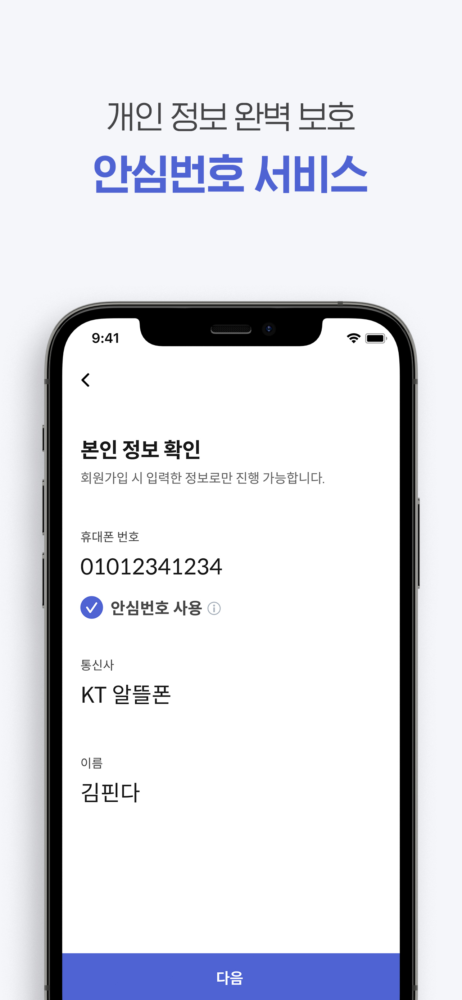
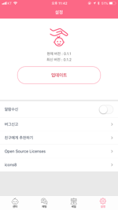

엄기철 Eom Kicheol

- iOS Developer
- Mail : <eom-kicheol@naver.com>
- github : https://github.com/EomKicheol
     

경력

### 째깍악어

- 2022.10 ~

### 핀다

- 2021.03 ~ 2022.09

### 비브로스

- 2020.02 ~ 2020.11

### 플라이앤컴퍼니

- 2018.09 ~ 2019.04

### 앱튜브

- 2017.07 ~ 2018.09

### 위키

- 2016.03 ~ 2016.11(프리랜서)

### ezfarm

- 2013.06 ~ 2015.12

### ITPOP

- 2012.03 ~ 2013.06

   

## 보유기술 및 사용가능 라이브러리

- Swift
- RxSwift
- Architecture Framework(MVVM, RxViewBinder, ReactorKit, VIP, Ribs)
- Restful API Network(alamofire, moya)
- Image downloading and caching(SDWebImage, Kingfisher)
- Autolayout(Storyboard & Code Base)
- SnapKit
- WKWebView
- Sqlite
- Firebase
- Fabric Crashlytics
- Naver SDK(map, login)
- Kakao SDK(Navi, login, search api, map, channelTalk)
- Google SDK(login, map, admob)
- Facebook SDK(login, audience Network)
- Kicc, 이니시스 결제 연동, Nice
- T-map
- AppleLogin
- XcodeGen
- SwiftPackageManager
- SwiftLint
- FastLane
- Tuist
- UnitTest
- AppsFlyer, Braze, Amplitude, Adjust 마케팅 툴 연동

##

### 회사 프로젝트

### iOS

### 째깍악어

- 회사 : 째깍악어
- 소개 : 유아
- 개발환경: Xcode
- 사용기술: Swift, RxSwift, ReactorKit, Cocoapods, SPM, Tuist, Firebase, Fastlane
- 수행업무:
  - 본인인증 신규 개발
  - 회원 가입 신규 개발
  - 패키지 상품 서비스 신규 개발
  - 선생님앱 LMS연동
  - 점진적앱 리펙토링 작업 중
  - 앱 마케팅을위해서 마케팅플랫폼( AppsFlyer, Braze, Amplitude, Deeplink, Deferred Deeplink) 연동
- 개선사항::
  _ fastlane 사용하여 파이어베이스 앱 배포 자동화
  _ fastlane 사용하여 Appstore, TestFlight 앱 배포 자동화
  _ fastlane 사용하여 배포인증서, 푸시 인증서 관리
  _ Tuist 을 이용한 멀티 모듈 환경구축
  _ 파편화되어 있는 프로젝트 아키텍처를 통일하기 위하여 ReactorKit, RxSwift 도입
  _ 코드의 가독성을 증진시키고 협업 에서 일관된 코드 스타일을 유지 하기 위하여 SwiftLint적용 \* iOS개발팀 내 Git-Flow 전략 및 코드리뷰 관련 정책 수립
        
       

### Finda

- 회사 : 핀다
- 소개 : 대출 비교, 신청 관리
- 개발환경: Xcode
- 사용기술: Swift, RxSwift, ReactorKit, Firebase, Moya, R.swift, Xcodegen, Cocoapods, Fastlane
- 수행업무:
  - 인트로, 온보딩, 홈 화면 리펙토링
  - 금융 스팸차단 기능개발
  - Deeplink, Deferred Deeplink 개발
  - 각종 analytics(firebase) 처리
  - 마이데이터 연동
  - 후순위 담보대출 -자가 보유자 여부에 따라 분기 처리하여 UX 및 인터랙션 개선
    - 아파트 주소 검색 UI 및 인터랙션 개선
    - 아파트 후순위 담보대출을 위해 필요한 정보 입력 여부에 따라 일반 화면과 담보대출 필터 화면
- 개선사항:
  - Finda 마케팅을위해서 마케팅플랫폼( AppsFlyer) 연동지원
  - Xcodegen 도입하여 자주 발생하는 프로젝트 설정 파일 충돌 문제 해결
  - fastlane을 사용하여 파이어베이스 앱 배포를 자동화
  - 코드 생산성과 일관성을 위해 코드 템플릿 제작
  - 파편화되어 있는 프로젝트 아키텍처를 통일하기 위하여 Reactor Kit 도입
  - image, font 등을 불러올 때 수동으로 문자열을 작성하기 때문에 잘못 작성 시 크래쉬가 나는상황을
    줄이기 위해 R.swift를 사용하여 build시에 image, font, colors, localizable string 자동으로 상수화 시키도록 하여 크래쉬를 없애 안전성을 높임
  - 금융권 관련 모듈 적용으로 인한 시뮬레이터 빌드 안되는 현상 수정
  - 홈 리펙토링 이후 신규유저 CTA 유입 여부 A/B 테스트 적용
  - 포그라운드, 백그라운드 푸시 딥링크 버그 수정
  - 코드의 가독성을 증진시키고 협업하는 과정에서 일관된 코드 스타일을 유지 하기 위하여 SwiftLint적용
- 앱스토어 : https://apps.apple.com/KR/app/id1494077875?mt=8

       

### 똑닥

- 회사 : Bbros
- 앱소개 : 병원 예약/접수 약국찾기
- 개발환경: Xcode
- 사용기술: Swift, RxSwift, MVVM, Firebase, Moya, R.swift, Xcodegen, Cocoapods, SwiftPackageManager, SnsLogin(kakao, facebook, naver, apple)
- 수행업무:
  - 신규 검색 기능 고도화 작업으로 인한 앱 리펙토링
  - 통신 Layer분리 작업
- 개선사항:
  - Xcodegen 도입하여 자주 발생하는 프로젝트 설정 파일 충돌 문제 해결
  - 코드 생산성과 일관성을 위해 코드 템플릿 제작
  - 파편화되어 있는 프로젝트 아키텍처를 통일하기 위하여 MVVM  도입
  - image, font 등을 불러올 때 수동으로 문자열을 작성하기 때문에 잘못 작성 시 크래쉬가 나는상황을
    줄이기 위해 R.swift를 사용하여 build시에 image, font, colors, localizable string자동으로 상수화 시키도록 하여 크래쉬를 없애 안전성을 높임
  - (Swift Language Version → 3.0 에서 5.0으로 컨버팅 작업 진행
    오픈소스 라이브러리 Swift Language Version 에 따른 에러 해결 )
  - 코드의 가독성을 증진시키고 협업하는 과정에서 일관된 코드 스타일을 유지 하기 위하여 SwiftLint적용
- 앱스토어 : https://apps.apple.com/kr/app/똑닥/id1014889755

         

### 푸드플라이

- 회사 : 플라이앤컴퍼니
- 앱소개 : 푸드플라이 라이더 앱
- 개발환경: Xcode
- 사용기술 : Swift, MVVM, RxSwift
- 담당 업무 : 개발 유지/보수 작업
- 앱스토어 : 사내 배포용

### 하이타이

- 회사 : AppTube
- 앱소개 : 위치 기반의 태국 마사지샵 검색 서비스
- 개발환경: Xcode
- 사용기술 : Swift, MVVM, RxSwift, Code Base Auto Layout(Snapkit)
- 담당 업무 : 설계 및 개발 운영
- 앱스토어 : https://itunes.apple.com/kr/app/id947725771

    

### 모시러 드라이버

- 회사 : AppTube
- 앱소개 : 위치 기반의 시간제 차량 수행 기사 서비스
- 개발환경: Xcode
- 사용기술 : Swift, MVVM, RxSwift, Code Base Auto Layout(Snapkit)
- 담당 업무 : 설계 및 개발 유지/보수 작업
- 앱스토어 : https://itunes.apple.com/app/apple-store/id1262965984

   

### 동화면세점 국문, 중문

- 회사 : AppTube
- 앱소개 : 동화면세점 제품 구매를 위해 제작된 앱
- 개발환경: Xcode
- 사용기술 : Swift, WebKit
- 담당 업무 : 설계 및 개발 유지/보수 작업
- 앱스토어 : https://itunes.apple.com/kr/app/%EB%8F%99%ED%99%94%EB%A9%B4%EC%84%B8%EC%A0%90/id695404582?mt=8

    

# 개인 프로젝트

### [아이돌볼]

- 앱소개 : 국가에서 지원하는 12세 이하 아동 돌보미 서비스 기관 검색 앱.
- 개발환경: Xcode
- 사용기술 : Swift, MVVM, RxSwift, fireBase Realtime Database
- 개발 기간 : 2018.4 ~ 2018.5
- 앱스토어 : 현재 스토어에서 내려감

    

### [QuickNotes]

- 앱소개 : 빠르게 메모를 작성할수 있는 앱
- 개발환경: Xcode
- 사용기술 : Swift, SQlite
- 개발 기간 : 2017.01 ~ 2017. 02
- 앱스토어 : 현재 스토어에서 내려감

    

## JAVA

#### 삼성SDI케미칼 전사 분리

- 회사 : 위키
- 사용기술 : Java, Spring, Xplatform, Oracle
- 업무 내용 :기존 삼성 시스템과 SID케미칼 사의 연계된 NON- ERP 시스템 분리
   

#### 근로복지공단 상담 APP

- 회사 : 위키
- 사용기술 : Java, JavaScript, Oracle
- 업무 내용 : 기존복잡한 근로복지공단 상담 시스템 개발
   

#### Kahis 역학조사 고도화

- 회사 : ezfarm
- 사용기술 : Java, Spring, Xplatform, Oracle
- 업무 내용 : 기존복잡한 업무등록 시스템 고도화 작업

#### 가금농가 컨설팅 현지조사

- 회사 : ezfarm
- 사용기술 : Java, Spring, Xplatform, Oracle
- 업무 내용 : 가금농장의 운영상태 및 질병, 사양 컨설팅 정보 통합관리

#### Kahis

- 회사 : ezfarm
- 사용기술 : Java, Spring, Xplatform, Oracle
- 업무 내용 : 가축질별 방생의 사전예방 및 질병 발생시 확산 방지를 위해 최신 정보통신(ICT)기술을 활용하여 동물질병 및 가축방역 정보 통합정보 시스템 운영 및 개발
   

#### 현대라이프 모바일 전자청약 개발

- 회사 : ITPOP
- 사용기술 : Java, Android
- 업무 내용 : 현대라이프 모바일 전자청약 개발
- Android용 모바일 전자청약 개발
  Target Device 갤럭시 10.1 노트 LTE

#### 동부화재 모바일 전자청약 연계서버 개발

- 회사 : ITPOP
- 사용기술 : Java, Oracle
- 업무 내용 : 태블릿과 동부 화재 시스템 간에 인터페이스 서버 개발
- 동부 화재에서 사용 되고 있는 코볼 전문 통신 작업 연계

#### LG하이프라자 모바일 상품구매

- 회사 : ITPOP
- 사용기술 : Java, Oracle
- 업무 내용 : Lg하이프라자 모바일 기간계 시스템 중계서버 개발
- 태블릿을 이용한 상품 구매 시스템 개발
- 태블릿과 LGBEST 시스템간에 인터페이스 서버 개발
   
